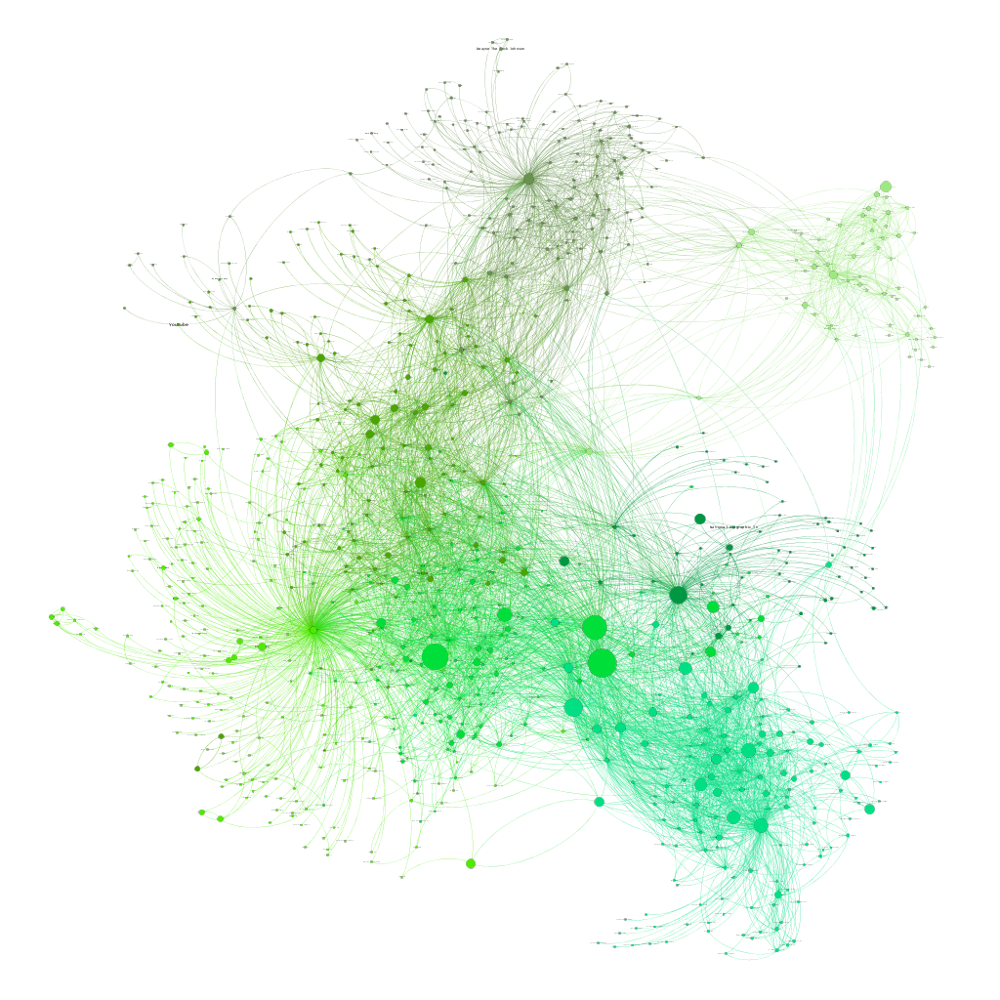

# Military Social Network Analysis

### Purpose

**This site is a way to visualize the relationships between various military-affiliated Facebook pages.**

I scraped the data from Facebook using Netvizz and did the graph analysis (creating communities in the data, running PageRank to figure out which pages are most important, etc.) and visualization in Gephy.

Head to https://samgoodgame.github.io/network_analysis/ to check it out.

